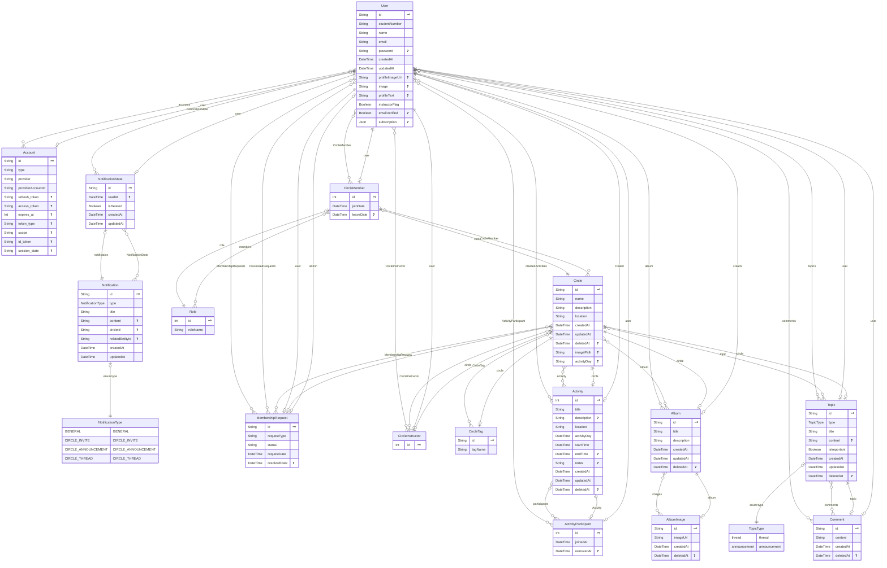

```mermaid
erDiagram

        TopicType {
            thread thread
announcement announcement
        }


        NotificationType {
            GENERAL GENERAL
CIRCLE_INVITE CIRCLE_INVITE
CIRCLE_ANNOUNCEMENT CIRCLE_ANNOUNCEMENT
CIRCLE_THREAD CIRCLE_THREAD
        }

  "User" {
    String id "🗝️"
    String studentNumber
    String name
    String email
    String password "❓"
    DateTime createdAt
    DateTime updatedAt
    String profileImageUrl "❓"
    String image "❓"
    String profileText "❓"
    Boolean instructorFlag
    Boolean emailVerified "❓"
    Json subscription "❓"
    }


  "Account" {
    String id "🗝️"
    String type
    String provider
    String providerAccountId
    String refresh_token "❓"
    String access_token "❓"
    Int expires_at "❓"
    String token_type "❓"
    String scope "❓"
    String id_token "❓"
    String session_state "❓"
    }


  "Circle" {
    String id "🗝️"
    String name
    String description
    String location
    DateTime createdAt
    DateTime updatedAt
    DateTime deletedAt "❓"
    String imagePath "❓"
    String activityDay "❓"
    }


  "CircleMember" {
    Int id "🗝️"
    DateTime joinDate
    DateTime leaveDate "❓"
    }


  "MembershipRequest" {
    String id "🗝️"
    String requestType
    String status
    DateTime requestDate
    DateTime resolvedDate "❓"
    }


  "CircleInstructor" {
    Int id "🗝️"
    }


  "CircleTag" {
    String id "🗝️"
    String tagName
    }


  "Role" {
    Int id "🗝️"
    String roleName
    }


  "Activity" {
    Int id "🗝️"
    String title
    String description "❓"
    String location
    DateTime activityDay
    DateTime startTime
    DateTime endTime "❓"
    String notes "❓"
    DateTime createdAt
    DateTime updatedAt
    DateTime deletedAt "❓"
    }


  "ActivityParticipant" {
    Int id "🗝️"
    DateTime joinedAt
    DateTime removedAt "❓"
    }


  "Topic" {
    String id "🗝️"
    TopicType type
    String title
    String content "❓"
    Boolean isImportant
    DateTime createdAt
    DateTime updatedAt
    DateTime deletedAt "❓"
    }


  "Comment" {
    String id "🗝️"
    String content
    DateTime createdAt
    DateTime deletedAt "❓"
    }


  "Album" {
    String id "🗝️"
    String title
    String description
    DateTime createdAt
    DateTime updatedAt
    DateTime deletedAt "❓"
    }


  "AlbumImage" {
    String id "🗝️"
    String imageUrl
    DateTime createdAt
    DateTime deletedAt "❓"
    }


  "Notification" {
    String id "🗝️"
    NotificationType type
    String title
    String content "❓"
    String circleId "❓"
    String relatedEntityId "❓"
    DateTime createdAt
    DateTime updatedAt
    }


  "NotificationState" {
    String id "🗝️"
    DateTime readAt "❓"
    Boolean isDeleted
    DateTime createdAt
    DateTime updatedAt
    }

    "User" o{--}o "Account" : "accounts"
    "User" o{--}o "CircleMember" : "CircleMember"
    "User" o{--}o "CircleInstructor" : "CircleInstructor"
    "User" o{--}o "MembershipRequest" : "MembershipRequests"
    "User" o{--}o "MembershipRequest" : "ProcessedRequests"
    "User" o{--}o "Activity" : "createdActivities"
    "User" o{--}o "ActivityParticipant" : "ActivityParticipant"
    "User" o{--}o "Topic" : "topics"
    "User" o{--}o "Comment" : "comments"
    "User" o{--}o "Album" : "album"
    "User" o{--}o "NotificationState" : "NotificationState"
    "Account" o|--|| "User" : "user"
    "Circle" o{--}o "CircleMember" : "CircleMember"
    "Circle" o{--}o "CircleInstructor" : "CircleInstructor"
    "Circle" o{--}o "CircleTag" : "CircleTag"
    "Circle" o{--}o "MembershipRequest" : "MembershipRequest"
    "Circle" o{--}o "Activity" : "Activity"
    "Circle" o{--}o "Album" : "Album"
    "Circle" o{--}o "Topic" : "topic"
    "CircleMember" o|--|| "User" : "user"
    "CircleMember" o|--|| "Circle" : "circle"
    "CircleMember" o|--|| "Role" : "role"
    "MembershipRequest" o|--|| "User" : "user"
    "MembershipRequest" o|--|| "Circle" : "circle"
    "MembershipRequest" o|--|o "User" : "admin"
    "CircleInstructor" o|--|| "User" : "user"
    "CircleInstructor" o|--|| "Circle" : "circle"
    "CircleTag" o|--|| "Circle" : "circle"
    "Role" o{--}o "CircleMember" : "members"
    "Activity" o{--}o "ActivityParticipant" : "participants"
    "Activity" o|--|| "Circle" : "circle"
    "Activity" o|--|| "User" : "creator"
    "ActivityParticipant" o|--|| "Activity" : "Activity"
    "ActivityParticipant" o|--|| "User" : "user"
    "Topic" o|--|| "TopicType" : "enum:type"
    "Topic" o{--}o "Comment" : "comments"
    "Topic" o|--|| "User" : "user"
    "Topic" o|--|| "Circle" : "circle"
    "Comment" o|--|| "Topic" : "topic"
    "Comment" o|--|| "User" : "user"
    "Album" o{--}o "AlbumImage" : "images"
    "Album" o|--|| "Circle" : "circle"
    "Album" o|--|| "User" : "creator"
    "AlbumImage" o|--|| "Album" : "album"
    "Notification" o|--|| "NotificationType" : "enum:type"
    "Notification" o{--}o "NotificationState" : "NotificationState"
    "NotificationState" o|--|| "User" : "user"
    "NotificationState" o|--|| "Notification" : "notification"
```
